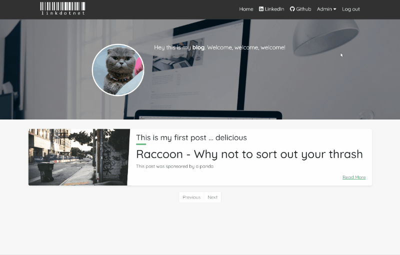

# LinkDotNet.Blog
[](https://github.com/linkdotnet/Blog/actions/workflows/dotnet.yml)
[](https://github.com/linkdotnet/Blog/actions/workflows/codeql.yml)

This is a blog software completely written in C# / Blazor. The aim is to have it configurable as possible. 

## How does it work
The basic idea is that the content creator writes his posts in markdown language (like this readme file). 
The markdown will then be translated into HTML and displayed to the client. This gives an easy entry to writing posts with all the flexibility markdown has.
This also includes source code snippets. Highlighting is done via [highlight.js](https://highlightjs.org/) with the GitHub theme.

## In Action


## Setup
Just clone this repository and you are good to go. There are some settings you can tweak. The following chapter will guide you 
through the possibilities.

### appsettings.json
The appsettings.json file has a lot of options to customize the content of the blog. The following table shows which values are used when.

```json
{
  "BlogName": "linkdotnet",
  "BlogBrandUrl": "http//some.url/image.png",
  "GithubAccountUrl": "",
  "Social": {
    "GithubAccountUrl": "",
    "LinkedInAccountUrl": "",
    "TwitterAccountUrl":  ""
  },
  "Introduction": {
    "Description": "Some nice text about yourself. Markup can be used [Github](https://github.com/someuser/somerepo)",
    "BackgroundUrl": "assets/profile-background.webp",
    "ProfilePictureUrl": "assets/profile-picture.webp"
  },
  "PersistenceProvider": "InMemory",
  "ConnectionString": "",
  "DatabaseName": "",
  "Auth0": {
    "Domain": "",
    "ClientId": "",
    "ClientSecret": ""
  },
  "BlogPostsPerPage": 10,
  "AboutMeProfileInformation": {
    "Name": "Steven Giesel",
    "Heading": "Software Engineer",
    "ProfilePictureUrl": "assets/profile-picture.webp"
  },
  "Giscus": {
    "Repository": "github/repo",
    "RepositoryId": "id",
    "Category": "general",
    "CategoryId": "id"
  },
 "Disqus": {
  "Shortname": "blog"
 },
 "KofiToken": "ABC123",
 "GithubSponsorName": "your-tag-here"
}

```

| Property                  | Type           | Description                                                                                                                                                     |
| ------------------------- | -------------- | --------------------------------------------------------------------------------------------------------------------------------------------------------------- |
| BlogName                  | string         | Name of your blog. Is used in the navbar and is used as the title of the page. Will not be shown when `BlogBrandUrl` is set                                     |
| BlogBrandUrl              | string         | The url to an image which is used as a brand image in the navigation bar. If not set or `null` the `BlogName` will be shown                                     |
| Social                    | node           | Represents all possible linked social accounts                                                                                                                  |
| GithubAccountUrl          | string         | Url to your github account. If not set it is not shown in the introduction card                                                                                 |
| LinkedInAccountUrl        | string         | Url to your LinkedIn account. If not set it is not shown in the introduction card                                                                               |
| TwitterAccountUrl         | string         | Url to your Twitter account. If not set it is not shown in the introduction card                                                                                |
| Introduction              |                | Is used for the introduction part of the blog                                                                                                                   |
| Description               | MarkdownString | Small introduction text for yourself. This is also used for `<meta name="description">` tag. For this the markup will be converted to plain text                |
| BackgroundUrl             | string         | Url or path to the background image. (Optional)                                                                                                                 |
| ProfilePictureUrl         | string         | Url or path to your profile picture                                                                                                                             |
| PersistenceProvider       | string         | Declares the type of the storage provider (one of the following: `SqlServer`, `Sqlite`, `RavenDb`, `InMemory`). More in-depth explanation down below            |
| ConnectionString          | string         | Is used for connection to a database. Not used when `InMemoryStorageProvider` is used                                                                           |
| DatabaseName              | string         | Name of the database. Only used with `RavenDbStorageProvider`                                                                                                   |
| Auth0                     |                | Configuration for setting up Auth0                                                                                                                              |
| Domain                    | string         | See more details here: https://manage.auth0.com/dashboard/                                                                                                      |
| ClientId                  | string         | See more details here: https://manage.auth0.com/dashboard/                                                                                                      |
| ClientSecret              | string         | See more details here: https://manage.auth0.com/dashboard/                                                                                                      |
| BlogPostsPerPage          | int            | Gives the amount of blog posts loaded and display per page. For more the user has to use the navigation                                                         |
| AboutMeProfileInformation | node           | Sets information for the About Me Page. If omitted the page is disabled completely                                                                              |
| Name                      | string         | Name, which is displayed on top of the profile card                                                                                                             |
| Heading                   | string         | Displayed under the name. For example job title                                                                                                                 |
| ProfilePictureUrl         | string         | Displayed profile picture                                                                                                                                       |
| Giscus                    | node           | Enables the comment section via giscus. If left empty the comment secion will not be shown. For more information checkout the section about comments down below |
| Disqus                    | node           | Enables the comment section via disqus. If left empty the comment secion will not be shown. For more information checkout the section about comments down below |
| KofiToken                 | string         | Enables the "Buy me a Coffee" button of Kofi. To aquire the token head down to the "Kofi" section                                                               |
| GithubSponsorName         | string         | Enables the "Github Sponsor" button which redirects to GitHub. Only pass in the user name instead of the url.                                                   |

## Storage Provider
Currently there are 4 Storage-Provider:
 * InMemory - Basically a list holding your data (per request). If the User hits a hard reload, the data is gone.
 * RavenDb - As the name suggests for RavenDb. RavenDb automatically creates all the documents, if a database name is provided.
 * Sqlite - Based on EF Core, so it can be easily adapted for other Sql Dialects. The tables are automatically created.
 * SqlServer - Based on EF Core, so it can be easily adapted for other Sql Dialects. The tables are automatically created.

The default (when you clone the repository) is the `InMemory` option. That means everytime you restart the service, all posts and related objects are gone.

## Comment Section
For comments the blog is using [giscus](https://giscus.app/) or [disqus](https://disqus.com/). 

**Note**: Please only register one service / provide the configuration for one node. The given configuration shows both only for demonstrational purposes.
If multiple comment plugins are configured at the same time a warning will be displayed under the blog post itself.

### Giscus
To provide the necessary values head over to https://giscus.app/ and go to the configuration section.
There you can enter all the information. You will find a detailed guide on the site.

In short:
 * You need a public repository where the comments are hosted. Recommendation: Create a new repository just for the comments
 * You have to link the [giscus app](https://github.com/apps/giscus) to at least the repository where the comments are hosted
 * You have to enable the discussion feature in the repository (see [here](https://docs.github.com/en/github/administering-a-repository/managing-repository-settings/enabling-or-disabling-github-discussions-for-a-repository)
 )

 After you configured everything on the site, you get the `<script>` tag which you could embed. The blog needs the following information.

 Here you can find an example. This is how the script tag looks on giscus.
 ```javascript
 <script src="https://giscus.app/client.js"
        data-repo="your_username/reponame"
        data-repo-id="M9/ab=="
        data-category="General"
        data-category-id="AbC==/8_D"
        async>
</script>
```
Now you can copy/paste those information into the appsettings.json. With the given information abobe your appsettings.json looks like this:
```json
  "Giscus": {
    "Repository": "your_username/reponame",
    "RepositoryId": "M9/ab==",
    "Category": "General",
    "CategoryId": "AbC==/8_D"
  }
```

### Disqus
For disqus you only need the shortname (site-name) which you can find for example under your [home-tab](https://disqus.com/home/).

## Authorization
There is only one real mechanism enabled via Auth0. For more information go to: https://auth0.com/docs/applications

The main advantage of Auth0 is the easy configurable dashboard on their website.

For testing purposes you can use `services.UseDummyAuthentication();`. This allows every user, who presses Login, to be logged in.

## Donations
The blog software allows you to integrate via different micro-transaction services. The following chapter will show you how to setup donations.

### Ko-fi
You can use [Ko-fi](https://Ko-fi.com/) as payment service to receive donations. To aquire the `KofiToken` as seen in the config above, head to [wdigets page](https://Ko-fi.com/manage/widgets), click on "Ko-fi Button".
Now choose "Image" as type. In the field below under `Copy & Paste Code` you see an `<a href='https://ko-fi.com/XYZ'` tag. Just take the `XYZ` part and put it into `KofiToken`.

### GitHub Sponsor
Enables the usage of [GitHub Sponsors](https://github.com/sponsors) as payment service to receive donations. Only pass in your username. The button will use the following url: `https://github.com/sponsors/{your-user-name}`.

## Search Engine Optimization (SEO)
The blog includes some of the most important tags to get indexed by a crawler. Furthermore some aspects of the Open Graph specification are implemented.

### Robots.txt
In the wwwroot/ you can find a default robots.txt. It allows that the site gets completely indexed. If you want to tweak that behavior feel free.
Also you can provide a sitemap.xml to get a better ranking. The blog can create a sitemap.xml on its own. For that login and click on the `Admin` button in the navigation bar and afterwards on `Sitemap`. There you can let the blog create a new one for you. This is especially helpful after you created a new blog post to make easier for indexer like Google. 

### Open Graph Tags
To get better results when for example shared via LinkedIn some of the `<meta property="og:tag">` tags are implemented.

The following tags are set depending on the page:

| Open Graph Tag | Index                                                     | Display Blog Post                                                           |
| -------------- | --------------------------------------------------------- | --------------------------------------------------------------------------- |
| og:title       | Title of the blog (defined in Introduction)               | Title of the Blog Post                                                      |
| og:url         | Url to the index page                                     | Url of the page                                                             |
| og:image       | Profile image (defined in Introduction)                   | Uses the preview image. If a fallback is defined this will be used instead. |
| og:type        | article                                                   | article                                                                     |
| og:description | Short description in plain text (defined in Introduction) | Short Description of Blog Post in plain text                                |

Furthermore the following tags are set:

| Tag                                      | Index                                | Display Blog Post             |
| ---------------------------------------- | ------------------------------------ | ----------------------------- |
| Title of the web page                    | Defined in AppConfiguration.BlogName | Title of the blogpost         |
| &lt;meta name="keyword" content="" /&gt; | not set                              | Tags defined in the Blog Post |

## RSS Feed
This blog also offers a RSS feed ([RSS 2.0 specification](https://validator.w3.org/feed/docs/rss2.html)), which can be consumed by your users or programs like feedly. Just append `feed.rss` to your url or click on the RSS feed icon in the navigation bar to get the feed. The RSS feed does not expose the whole content of a given blog post but it's title and short description including some other tags like preview image, publishing date and so on.
