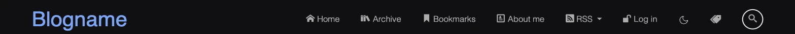
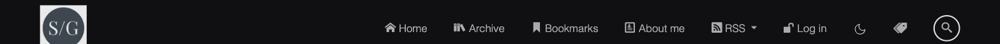
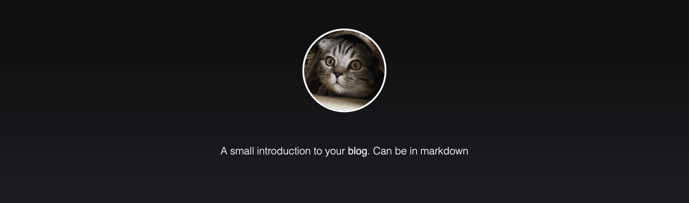

## Styling

- [Styling](#styling)
- [Colors \& Fonts](#colors--fonts)
  - [Light / Dark Mode](#light--dark-mode)
- [Icons](#icons)
- [Brand Image vs. Blog Name](#brand-image-vs-blog-name)
- [Introduction Background Image](#introduction-background-image)

This page lists what can currently be styled and where in the code to find it. There is no
in-app theme picker yet - styling is done via CSS custom properties. All values live in a
single file: `src/LinkDotNet.Blog.Web/wwwroot/css/basic.css`.

## Colors & Fonts

The top of `basic.css` defines all custom properties used throughout the site:

```css
:root, html[data-bs-theme='light'] {
    /* Fonts */
    --default-font: 'Calibri';
    --code-font: 'Lucida Console', 'Courier New';

    /* Color definitions */
    --wild-sand: #f4f4f4;
    --silver: #dadada;
    --waterloo: rgba(140, 140, 162, 0.25);

    /* Usages */
    --background: var(--wild-sand);
    --tag-background: var(--waterloo);
    --background-gradient-start: var(--wild-sand);
    --background-gradient-end: var(--silver);
}
```

- `--default-font` is the font used for the whole page body.
- `--code-font` is the font used inside fenced code blocks.
- The color variables follow a "definition" + "usage" pattern: `--wild-sand`, `--silver` and
  `--waterloo` are the raw colors, while `--background`, `--tag-background` and
  `--background-gradient-*` are what the rest of the CSS actually reads. To change a color,
  either edit the raw color or repoint the usage variable to a different color.
- The block also overrides a couple of Bootstrap variables (`--bs-body-font-weight`,
  `--bs-nav-link-font-weight`) since the blog is built on top of Bootstrap.

To customize colors or fonts, edit the values in this file directly (there is currently no
`appsettings.json` option for this - see the maintainer note on [issue #529](https://github.com/linkdotnet/Blog/issues/529)
about a possible future theme configuration).

### Light / Dark Mode

The same variables are re-declared under `html[data-bs-theme='dark']` with a darker palette
(`--jaguar`, `--shark`, `--trout`). Which block applies is controlled by the `data-bs-theme`
attribute on the `<html>` element, toggled client-side by `ThemeToggler.razor` in
`src/LinkDotNet.Blog.Web/Features/Home/Components/`. The chosen theme is persisted in the
browser's local storage - it is not an `appsettings.json` setting.

## Icons

The icon font is defined in `src/LinkDotNet.Blog.Web/wwwroot/css/icons.css` via `@font-face`
and used throughout `basic.css` as `font-family: 'icons'`. The font files
(`icons.woff`, `icons.woff2`) live next to a `Blog.json` project file in
`src/LinkDotNet.Blog.Web/wwwroot/css/fonts/`.

The icons are created and downloaded from [icomoon.io](https://icomoon.io/app). Upload
`Blog.json` as a project there to add or remove icons. The icomoon-exported CSS normally
prefixes its classes; that prefix has been stripped from `icons.css` in this repo.

## Brand Image vs. Blog Name

The navigation bar shows either an image or the blog's name, controlled by the `BlogBrandUrl`
and `BlogName` properties (see the full reference in
[Configuration.md](../Setup/Configuration.md)):

- If `BlogBrandUrl` is set, that image is rendered in the navbar.
- If `BlogBrandUrl` is not set (or `null`), the `BlogName` text is rendered instead.

This is implemented in `NavMenu.razor` at `src/LinkDotNet.Blog.Web/Features/Home/Components/`:

```razor
@if (!string.IsNullOrEmpty(Configuration.Value.BlogBrandUrl))
{
    <a class="nav-brand ms-5" href="/">
        
    </a>
}
else
{
    <a class="nav-brand barcode ms-5" href="/">@Configuration.Value.BlogName</a>
}
```

Without `BlogBrandUrl`, the navbar falls back to the text-based `BlogName`:



With `BlogBrandUrl` set to an image URL, the navbar shows that image instead:



## Introduction Background Image

The intro card at the top of the home page (profile picture + description) can have an
optional background image, controlled by `Introduction:BackgroundUrl` (see
[Configuration.md](../Setup/Configuration.md)). This is implemented in
`IntroductionCard.razor` at `src/LinkDotNet.Blog.Web/Features/Home/Components/`:

- If `BackgroundUrl` is set, it's rendered behind the card with a dark overlay
  (`linear-gradient(0deg, rgba(0, 0, 0, 0.4), rgba(0, 0, 0, 0.4))`) for contrast, plus the
  `introduction-background` CSS class (`background-size: cover` in `basic.css`).
- If `BackgroundUrl` is not set (or `null`), no background image or gradient is rendered -
  the card just shows the page's default background.

With `Introduction:BackgroundUrl` set:


Without `Introduction:BackgroundUrl` set:


